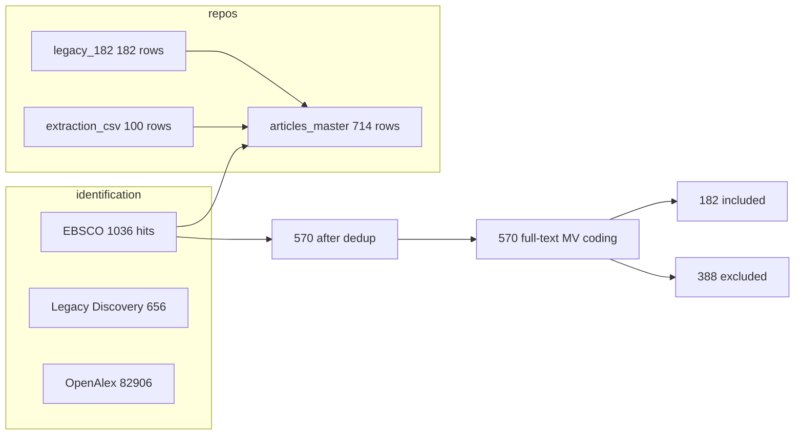

# Analysis Status Report — ULMC Systematic Review

**Generated**: 2026-06-24  
**Scope anchor**: **182 legacy gold standard** (`legacy/legacy_extracted_data.csv`, `final_include=TRUE`)  
**Machine-readable counts**: [`analysis_status_summary.csv`](analysis_status_summary.csv)

---

## Executive summary

| Dimension | Analyzed / complete | Pending | Notes |
|-----------|----------------------:|--------:|-------|
| **Legacy 182 — DistillerSR snippets** | **182** | 0 | All have `text_extraction`; not full structured CSV |
| **Legacy 182 — structured extraction CSV** | **69–81** | **101–111** | 69 exact `L{refid}` rows; up to 12 fuzzy matches to adjudicate |
| **Extraction CSV (100 rows)** | **~96 partial+** | **~4 sparse** | Key MV fields filled on most rows; Richardson/three-step sparse |
| **Master registry (`articles_master.csv`)** | **212** touched | **502** | 182 legacy-only + 30 complete EBSCO extractions |
| **EBSCO 2026 imports in master** | **506** metadata | **506** screening pending | Not yet linked to 570 PRISMA pool |
| **PDFs (legacy 182)** | **9** confirmed | **173** missing | Per `legacy_182_zotero_inventory.csv` |
| **PRISMA EBSCO strand** | **570** FT assessed | — | User-confirmed; see `EBSCO/PRISMA_06_24_2026_UPDATE.md` |

---

## 1. Coding schema — what we capture and where

### Field inventory by file

| Field group | Legacy CSV (`legacy_extracted_data.csv`) | Extraction CSV (`systematic_extraction_40_studies.csv`) | Master (`articles_master.csv`) | Config / codebook |
|-------------|-------------------------------------------|--------------------------------------------------------|--------------------------------|-------------------|
| **Study ID** | `Refid` | `study_order` (`L{n}` or numeric) | `article_id`, `legacy_refid`, `study_order` | `VARIABLE_CODEBOOK.md` §Identification |
| **Level 1 screening** | `Q1.1`, `Q1.2`, `Q1.3`, booleans | `management_domain`, `empirical_ulmc`, `not_pls`, `pls_sem_used` | `screening_status`, `screening_level1_include` | `config.yaml` screening.level1 |
| **MV / ULMC numeric** | `method_variance_pct` (71/182 numeric) | `method_variance_pct`, `harman_variance_pct` | `legacy_mv_pct` | Codebook §Method Variance |
| **Harman deployed** | ❌ text only | ✅ `harman_deployed` (15/100 filled) | ❌ join via `study_order` | `config.yaml` extraction.fields |
| **Statistical MV methods** | ❌ text in `text_extraction` | ✅ `statistical_methods_mv`, `statistical_method_detail` | ❌ | Codebook §Statistical Methods |
| **Procedural remedies** | ❌ text only | ✅ `procedural_remedies_used`, `procedural_remedies_list` | ❌ | Codebook §Procedural Remedies |
| **Richardson (2009)** | ❌ | ✅ 4 fields | ❌ | Codebook §Richardson |
| **Three-step ULMC** | partial in `author_fit_claims` | ✅ 5 step fields | ❌ | Codebook §Three-Step |
| **ULMC fit / final model** | `ulmc_improves_fit`, `ulmc_in_final` | same + `author_fit_claims` | ❌ | Codebook §ULMC Fit |
| **Sample / design** | ❌ | `sample_n`, `num_constructs`, `study_design`, etc. | bibliographic only | Codebook §Sample / Study Characteristics |
| **Free text** | `text_extraction`, `author_conclusion` | `notes`, `author_conclusion_mv` | `legacy_text_snippet`, `notes` | — |
| **PDF / Zotero** | ❌ | ❌ | `zotero_key`, `pdf_path`, `has_pdf` | `SCHEMA.md` §Assets |

**Authoritative structured schema**: `review/EBSCO/VARIABLE_CODEBOOK.md` (47 columns) + `review/config.yaml` extraction.fields.

**Legacy CSV columns** (18): `Refid`, `Q1.1`–`Q1.3`, `management_domain`, `empirical_ulmc`, `not_pls`, `level1_include`, `text_extraction`, `author_fit_claims`, `ulmc_improves_fit`, `method_variance_pct`, `author_conclusion`, `ulmc_in_final`, `final_include`, `source`, `extraction_date`.

**Master registry** holds provenance and join keys only — detailed MV fields stay in extraction CSV (see `master/SCHEMA.md`).

---

### Priority coding fields — completeness (extraction CSV, n=100)

| Field | Filled | % | Status |
|-------|-------:|--:|--------|
| `statistical_methods_mv` | 38 | 38% | ⚠️ Partial |
| `method_variance_pct` | 38 | 38% | ⚠️ Partial |
| `procedural_remedies_list` | 58 | 58% | ⚠️ Partial |
| `procedural_remedies_used` | 16 | 16% | ⚠️ Many inferred from list; audit needed |
| **`harman_deployed`** | **15** | **15%** | ⚠️ Column exists; backfill from `statistical_methods_mv` / `harman_variance_pct` |
| `harman_variance_pct` | 9 | 9% | ⚠️ Low |
| `richardson_2009_cited` | 25 | 25% | ⚠️ Low |
| `richardson_citation_context` | 24 | 24% | ⚠️ Low |
| `three_step_approach_used` | 5 | 5% | ❌ Sparse |
| `three_step_complete` | 6 | 6% | ❌ Sparse |
| `step1_baseline_reported` | 7 | 7% | ❌ Sparse |
| `avg_factor_loading_change` | 0 | 0% | ❌ Empty |
| `ulmc_in_final` | 0 | 0% | ❌ Empty (legacy has some) |

**Field-group averages** (100-row CSV): identification 75%, level-1 60%, procedural 58%, stat-methods 32%, Richardson 14%, three-step 6%.

---

### Example populated vs empty fields

| Field | Populated example | Empty example |
|-------|-------------------|---------------|
| `harman_deployed` | `study_order=3` → `TRUE` | `study_order=9` → empty |
| `procedural_remedies_list` | `study_order=5` → `anonymity; item pretesting; separation between measures` | `study_order=3` → `none` |
| `three_step_complete` | `study_order=7` → `TRUE` | `study_order=3` → `FALSE` |
| `richardson_2009_cited` | `study_order=9` → `TRUE` | `study_order=3` → `FALSE` |
| `method_variance_pct` | `study_order=3` → `28` | `study_order=5` → `NA` |
| `statistical_methods_mv` | `study_order=4` → `ULMC; Harman single factor test` | `study_order=3` → partial in `statistical_method_detail` only |

**Legacy populated example** (Refid 2): `method_variance_pct=17.2`, `ulmc_improves_fit=Yes`, full `text_extraction` ULMC paragraph — but **no** `harman_deployed`, procedural remedies, or Richardson fields.

---

### Are we missing anything important?

| Gap | Severity | Action |
|-----|----------|--------|
| `harman_deployed` only 15% filled | **High** | Backfill from Harman strings in `statistical_methods_mv` + non-NA `harman_variance_pct` |
| Three-step / Richardson sparse | **High** | Manual pass on 182 gold; regex assist insufficient |
| `procedural_remedies_used` vs `list` mismatches | **Medium** | Audit per RESTART_CHECKLIST B20 |
| Legacy 101 rows without CSV row | **High** | Fresh extraction from PDFs / snippets |
| `ulmc_in_final` empty in CSV but present in legacy | **Medium** | Port from `legacy_extracted_data.csv` |
| `schema.json` stale vs `config.yaml` | **Low** | Deprecate or sync (B32) |
| Master `pdf_path` unset (0 rows) | **High** | Populate after PDF hunt |

**Schema itself is complete** for the research questions (Harman, procedural remedies, ULMC %, three-step, Richardson). **Capture is incomplete** on ~55% of legacy 182 and on judgment-heavy fields across the 100-row CSV.

---

## 2. Analyzed vs pending — by source

### Legacy 182 (`legacy_extracted_data.csv`)

| Status | Count | Description |
|--------|------:|-------------|
| Included gold standard | **182** | `final_include=TRUE` |
| With DistillerSR text snippet | **182** | Reusable for quote verification |
| With numeric `method_variance_pct` | **71** | 111 rely on text-only MV coding |
| Exact overlap in extraction CSV (`L{refid}`) | **69** | Reuse tier — spot-check + backfill new fields |
| Probable + weak fuzzy overlap | **12** | Adjudicate in `legacy_182_fuzzy_review.csv` |
| **Legacy-only (no CSV row)** | **101** | Queue: `legacy_182_gaps_only.csv` |
| Master `extraction_status=legacy_only` | **182** | Snippet only, not structured complete |

### Extraction CSV (`systematic_extraction_40_studies.csv`)

| Status | Count | Description |
|--------|------:|-------------|
| Total rows | **100** | 47 columns |
| Legacy `L*` rows | **69** | Linked to DistillerSR Refids |
| Non-legacy numeric rows | **31** | 19 outside legacy 182 scope |
| Rows with ≥4/5 key MV fields filled | **~96** | `statistical_methods_mv`, MV%, remedies, L1 booleans |
| Master tagged `extraction_csv` | **99** | 1 row not merged |
| Master `extraction_status=complete` | **30** | Full template pass on EBSCO numerics |

### EBSCO master (`articles_master.csv`, 714 rows)

| Status | Count | Description |
|--------|------:|-------------|
| Total registry rows | **714** | Unified deduplicated registry |
| Legacy 182 rows | **182** | `screening_status=included` |
| EBSCO 2026 batch rows | **506** | `screening_status=pending` |
| Extraction none | **502** | Awaiting structured coding |
| Extraction complete | **30** | EBSCO supplement studies |
| Overlap legacy ∩ EBSCO in master | **0** | Separate source tags; crosswalk via refid/DOI manual |

### PRISMA EBSCO strand vs master

| Metric | PRISMA (user) | Master repo |
|--------|-------------:|------------:|
| Identification | 1,036 | 1,031 logged |
| After dedup | 570 | 506 unique EBSCO imports |
| Full-text assessed | 570 | Not tracked per-row in master |
| Included | 182 | 182 legacy in master |

---

## 3. PDF status

### Legacy 182 — `legacy_182_zotero_inventory.csv`

| Status | Count |
|--------|------:|
| In Zotero (`in_zotero=yes`) | **15** |
| **PDF confirmed** (`has_pdf=yes`) | **9** |
| **PDF missing** | **173** |
| Not found in Zotero search | **166** |

**PDF confirmed Refids**: 4, 5, 16, 19, 142, 151, 171, 175, 181.

### `zotero_pdf_match_report.csv` (193 rows; live scan 2026-06-24)

Rerun: `python review/legacy/run_zotero_pdf_match.py`. **Full library crosswalk** (all ~1,071 items): `python review/legacy/zotero_full_crosswalk.py` → `zotero_full_crosswalk.csv`, `zotero_orphan_pdfs.csv`, `master_missing_zotero.csv`; then `python review/master/backfill_zotero_keys.py`.

| Status | Count |
|--------|------:|
| PDF found (`has_pdf=Y`) | **8** |
| PDF missing (`has_pdf=N`) | **180** |

### Master registry PDF flags

| Metric | Count |
|--------|------:|
| `has_pdf=TRUE` | **9** |
| `pdf_path` set | **0** |

### Gap categories

| Gap type | Count | Notes |
|----------|------:|-------|
| Legacy included, no PDF | **173** | Blocks full re-extraction |
| Legacy included, no CSV row | **101** | Blocks structured synthesis row |
| Legacy included, no PDF **and** no CSV | **~90+** | Highest priority |
| EBSCO master pending screening | **506** | Metadata only |
| Screened in PRISMA (570) but not in master | **~64** | Export gap + dedup reconciliation |

---

## 4. Top priority articles — PDF or extraction still needed

### Hunt list (`ARTICLES_TO_FIND_10.md`) — highest priority

| Refid | Journal / topic | PDF | Extraction CSV | Notes |
|------:|-----------------|-----|----------------|-------|
| **142** | JWOP telepressure | ✅ Found | ❌ No `L142` | PDF at `pdfs/EBSCO_014_Hu_et_al_2019_...`; add structured row |
| **147** | IJHRM, MV 18% | ❌ | ❌ | Distinctive ULMC χ² snippet; no DOI in inventory |
| **153** | JIBS, MV 16% | ❌ | ❌ | High-value international business study |
| **160** | J Business Ethics | ❌ | ❌ | DOI `10.1007/s10551-016-3078-x` |
| **161** | European Mgmt Review, MV 3.15% | ❌ | ❌ | — |
| **163** | Business Ethics EU Review, MV 18.78% | ❌ | ❌ | — |
| **165** | Sustainability / finance | ❌ | ❌ | Verify not PLS false-positive |
| **166** | — | ❌ | ❌ | Hunt list |
| **172** | Family firms DOI `10.1007/s40821-021-00183-z` | ❌ | ❌ | — |
| **191** | Public health sector leadership | ❌ | ❌ | DOI `10.1177/0091026018816340` |

### Next tier — legacy gaps with MV% but no PDF (from `legacy_182_gaps_only.csv`)

| Refid | Journal hint |
|------:|--------------|
| 146 | British J Management, MV 0.9% |
| 153 | J Int'l Business Studies, MV 16% |
| 160 | J Business Ethics, MV 25% |
| 161 | European Management Review, MV 3.15% |
| 163 | Business Ethics EU Review, MV 18.78% |

---

## 5. Action items (priority order)

1. **Backfill `harman_deployed`** on 69–100 existing CSV rows from Harman strings / `harman_variance_pct` (quick win).
2. **Locate PDFs** for hunt-list Refids 147, 153, 160, 161, 163, 172, 191 (142 done).
3. **Add `L142` extraction row** — PDF verified, snippet in legacy, no CSV row yet.
4. **Fresh structured extraction** for **101 legacy-only** Refids (`legacy_182_gaps_only.csv`).
5. **Adjudicate 12 fuzzy** legacy ↔ CSV matches (`legacy_182_fuzzy_review.csv`).
6. **Export gap 251–300** EBSCO positions; re-merge master; reconcile **506 vs 570** PRISMA pool.
7. **Audit procedural_remedies_used** boolean vs list inconsistencies (Studies 3–10 flagged previously).
8. **Populate master `pdf_path`** when PDFs land in `review/EBSCO/pdfs/`.
9. **Three-step + Richardson manual pass** on reuse tier (69 `L*` rows) — fields &lt;25% filled.
10. **PRISMA exclusion breakdown** — verify 94/12/24/258 against DistillerSR for publication.

---

## 6. Crosswalk diagram

---

## Related files

| File | Purpose |
|------|---------|
| [`EBSCO/PRISMA_06_24_2026_UPDATE.md`](EBSCO/PRISMA_06_24_2026_UPDATE.md) | PRISMA numbers and discrepancies |
| [`EBSCO/VARIABLE_CODEBOOK.md`](EBSCO/VARIABLE_CODEBOOK.md) | Full field definitions |
| [`config.yaml`](config.yaml) | Screening + extraction schema source |
| [`master/SCHEMA.md`](master/SCHEMA.md) | Master registry columns |
| [`RESTART_CHECKLIST.md`](RESTART_CHECKLIST.md) | Session-oriented checklist |
| [`LEGACY_182_WORKPLAN.md`](LEGACY_182_WORKPLAN.md) | Phased 182-first plan |
| [`legacy/ARTICLES_TO_FIND_10.md`](legacy/ARTICLES_TO_FIND_10.md) | PDF hunt pilot batch |
