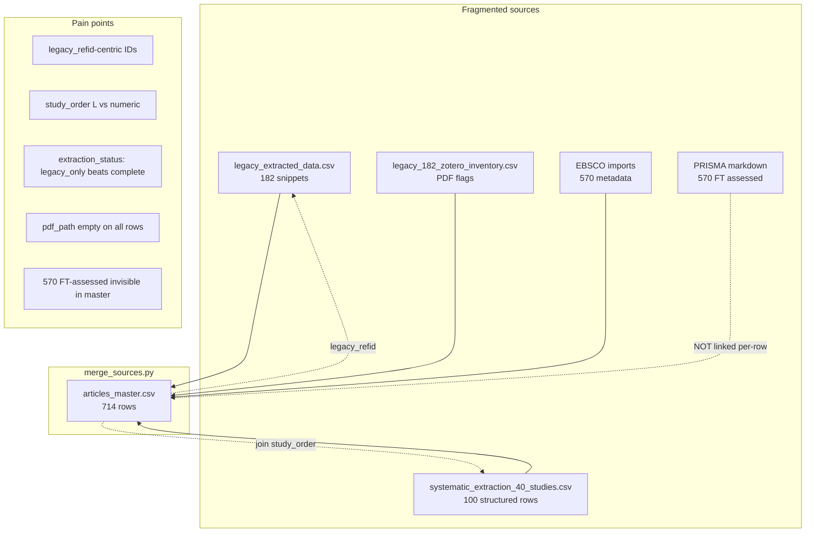
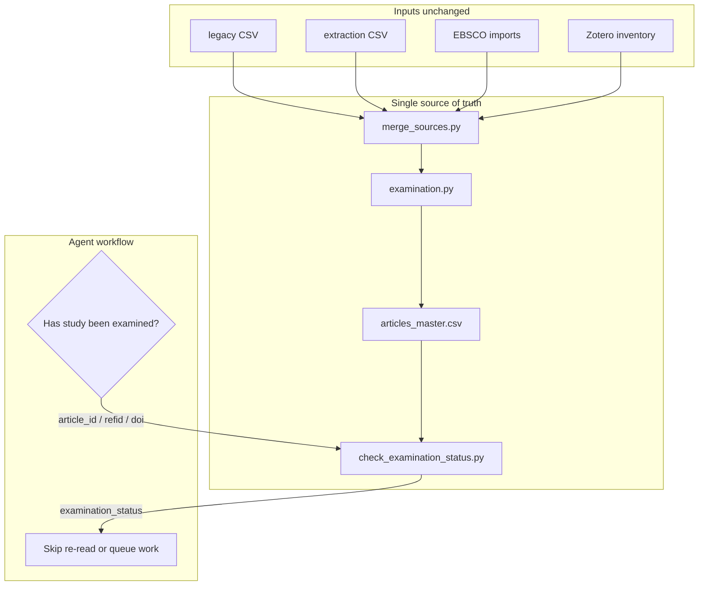

# Refactor: Examination Tracking for Growing Corpus

**Date**: 2026-06-24  
**Decision**: **Yes — incremental refactor** (not a big-bang rewrite)  
**Implemented in this pass**: `examination_status` + related columns, backfill script, query CLI, `extraction_status` merge fix

---

## Executive summary

The review pipeline already has a canonical registry (`articles_master.csv`) but **examination state was fragmented** across legacy snippets, extraction CSV rows, Zotero PDF flags, and PRISMA notes. Agents could not reliably answer “has this study already been examined?” without reading multiple files.

**Recommendation**: Keep `articles_master.csv` as the single queryable source of truth; add computed examination columns; deprecate the mental model of “exactly 182” in favor of `corpus_tier` + `screening_status`. The final included set may exceed 182 — track inclusion with `screening_status=included`, not a fixed count.

---

## 1. Current state (pre-refactor)

### Where “examined” lived

| Signal | Location | Granularity | Agent-friendly? |
|--------|----------|-------------|-----------------|
| DistillerSR text snippet | `legacy_extracted_data.csv` → `legacy_text_snippet` | 182 legacy | Partial |
| Structured MV coding | `systematic_extraction_40_studies.csv` | 100 rows | Yes, but separate file |
| Extraction rollup | `extraction_status` on master | 714 rows | **Broken** for 69 overlap rows |
| PDF availability | `has_pdf`, Zotero inventory | 182 legacy | Partial |
| Screening / inclusion | `screening_status` | 714 rows | Yes for legacy; EBSCO mostly `pending` |
| PRISMA FT-assessed (570) | `PRISMA_06_24_2026_UPDATE.md` | Strand-level only | **Not per-row** |
| Duplicate / overlap | `duplicate_report.md`, `legacy_182_overlap_report.csv` | Conflict list | On import only |

### Current state diagram



### Pain points (detailed)

1. **`legacy_refid`-centric model** — New EBSCO-included studies may have no Refid; agents default to hunting 1–315 range.
2. **`study_order` dual namespace** — `L{refid}` vs numeric EBSCO order; join key is implicit.
3. **`extraction_status` merge bug** — `merge_field()` kept longer string `legacy_only` over `complete` for all 69 legacy∩extraction rows.
4. **No `examination_status`** — Agents must infer from `sources` + external CSVs.
5. **`pdf_path` unset** — Only `has_pdf` boolean populated (9 true).
6. **`screening_status=pending` for 532 rows** — Includes EBSCO pool even though PRISMA says 570 FT-assessed; reconciliation gap.
7. **Hard “182” boundary** — Docs/scripts assume gold set size; final corpus may grow.

---

## 2. Proposed architecture

### Design principles

- **Single queryable file**: `articles_master.csv` (+ CLI wrapper)
- **Stable ID**: `article_id` (`M0001`) is canonical; `legacy_refid` and `study_order` are join aliases
- **Computed examination fields** — derived on merge, not hand-edited
- **Corpus can grow** — use `corpus_tier` + `screening_status`, not `legacy_182` count
- **Incremental migration** — small PRs, no rewrite of extraction CSV schema

### Target diagram



### Schema changes (implemented)

| Column | Type | Values | Editable? |
|--------|------|--------|-----------|
| `examination_status` | enum | `not_read`, `pdf_missing`, `read_snippet_only`, `partially_coded`, `fully_coded` | **Computed** |
| `pdf_status` | enum | `unknown`, `missing`, `available` | **Computed** from `has_pdf` |
| `corpus_tier` | enum | `legacy_gold`, `extraction_coded`, `ebsco_screened`, `supplementary` | **Computed** |
| `examination_source` | string | Audit trail | **Computed** |
| `examination_updated_at` | date | ISO date | **Computed** |

**Existing columns retained**:

- `screening_status` = inclusion pipeline (`pending` → `included`); use for “in final set?”
- `extraction_status` = structured coding depth (now rank-merged correctly)
- `article_id` = canonical study key for agents

### Deferred (not in this PR)

| Item | Rationale |
|------|-----------|
| Separate link table | Master widening sufficient at 714 rows |
| `ft_assessed` boolean per row | Needs PRISMA ↔ EBSCO position reconciliation |
| `pdf_path` population | Depends on PDF hunt workflow |
| `inclusion_status` duplicate column | `screening_status` already serves this |
| API/HTTP layer | CSV + CLI adequate for agents |
| Deprecate `legacy_182` source tag | Keep for provenance; use `corpus_tier` for logic |

---

## 3. Migration steps (ordered, small PRs)

### PR 1 — Examination columns + backfill ✅ (this pass)

- [x] Add `examination.py` computation module
- [x] Add `backfill_examination_status.py`
- [x] Add `check_examination_status.py`
- [x] Fix `extraction_status` rank merge in `merge_sources.py`
- [x] Update `SCHEMA.md`
- [x] Run backfill on `articles_master.csv`

### PR 2 — PRISMA row reconciliation (next)

- Export EBSCO positions 251–300 (already imported in later batches)
- Set `screening_status` for FT-assessed EBSCO rows (not just legacy 182)
- Optional: `ft_assessed=True` column from PRISMA log

### PR 3 — PDF path sync

- Wire `run_zotero_pdf_match.py` to set `pdf_path` + refresh `pdf_status`
- Populate hunt-list Refids (142, 147, …)

### PR 4 — Extraction queue automation

- Script: `legacy_gaps_only.csv` → filter `examination_status=read_snippet_only` AND no `study_order`
- Agent rule: never create duplicate `study_order` if master shows `partially_coded` or `fully_coded`

### PR 5 — Deprecate hard 182 in docs

- Update `ANALYSIS_STATUS_REPORT.md`, `LEGACY_182_WORKPLAN.md` to reference `corpus_tier=legacy_gold` + growing `screening_status=included`

---

## 4. Build first vs defer

| Build first | Defer |
|-------------|-------|
| Examination columns + CLI | HTTP API |
| `extraction_status` merge fix | Full extraction schema in master |
| Agent query examples in docs | Real-time Zotero sync |
| PRISMA per-row `ft_assessed` | Link table normalization |
| `pdf_path` backfill when PDFs land | Deprecating `legacy_refid` |

---

## 5. How agents should query

### Before examining any study

```bash
# Histogram — start here
python3 review/master/check_examination_status.py --summary

# By stable ID
python3 review/master/check_examination_status.py --article-id M0142

# By legacy Refid (DistillerSR)
python3 review/master/check_examination_status.py --legacy-refid 142

# By extraction key
python3 review/master/check_examination_status.py --study-order L142

# By DOI
python3 review/master/check_examination_status.py --doi 10.1111/joop.12503

# Queue: legacy snippets still needing structured CSV
python3 review/master/check_examination_status.py \
  --tier legacy_gold --status read_snippet_only --limit 200

# Queue: not yet read at all (mostly EBSCO metadata)
python3 review/master/check_examination_status.py --unexamined --limit 50
```

### Decision rules for agents

| `examination_status` | Action |
|---------------------|--------|
| `fully_coded` | **Do not re-extract**; spot-check or backfill sparse fields only |
| `partially_coded` | Extend existing `study_order` row; do not create new row |
| `read_snippet_only` | Structured extraction needed; check `pdf_status` first |
| `pdf_missing` | Locate PDF before full extraction |
| `not_read` | Screen (Level 1) then extract if included |

### CSV one-liners

```bash
# Count by examination status
python3 -c "import csv,collections; r=csv.DictReader(open('review/master/articles_master.csv')); print(collections.Counter(x['examination_status'] for x in r))"

# Included but not fully coded
python3 -c "
import csv
rows=[r for r in csv.DictReader(open('review/master/articles_master.csv'))
      if r['screening_status']=='included' and r['examination_status']!='fully_coded']
print(len(rows), 'included studies still need structured coding')
"
```

### Preventing duplicate examination

1. **Always query master first** via `check_examination_status.py` or `article_id`.
2. **Merge before import** — `merge_sources.py --new-csv` catches EBSCO duplicates vs legacy/extraction.
3. **`study_order` uniqueness** — If `L{refid}` exists in master, append to extraction CSV row; do not add second row.
4. **`examination_source` audit** — Explains why status was set; use when adjudicating fuzzy overlaps.

---

## 6. Backfill counts (2026-06-24)

Run: `python3 review/master/backfill_examination_status.py`

| examination_status | Count | Notes |
|--------------------|------:|-------|
| `not_read` | 502 | EBSCO metadata, no coding |
| `read_snippet_only` | 113 | Legacy 182 without extraction CSV row (182 − 69) |
| `partially_coded` | 31 | Legacy ∩ extraction overlap; key fields &lt; 4 |
| `fully_coded` | 68 | 38 legacy overlap + 30 EBSCO-only extractions |
| `pdf_missing` | 0 | Legacy rows all have snippets; none triggered |

| corpus_tier | Count |
|-------------|------:|
| `legacy_gold` | 182 |
| `ebsco_screened` | 502 |
| `extraction_coded` | 30 |

| extraction_status (after fix) | Count |
|--------------------------------|------:|
| `none` | 502 |
| `legacy_only` | 113 |
| `partial` | 31 |
| `complete` | 68 |

**Overlap fix verified**: 69 rows with both `legacy_182` and `extraction_csv` — 38 `complete` + 31 `partial` (was stuck at `legacy_only` for all 69).

---

## 7. Related files

| File | Role |
|------|------|
| `review/master/examination.py` | Status computation logic |
| `review/master/backfill_examination_status.py` | One-shot / refresh backfill |
| `review/master/check_examination_status.py` | Agent query CLI |
| `review/master/merge_sources.py` | Merge + auto-enrich on write |
| `review/master/SCHEMA.md` | Column definitions |
| `review/ANALYSIS_STATUS_REPORT.md` | Gap analysis (update in PR 5) |
